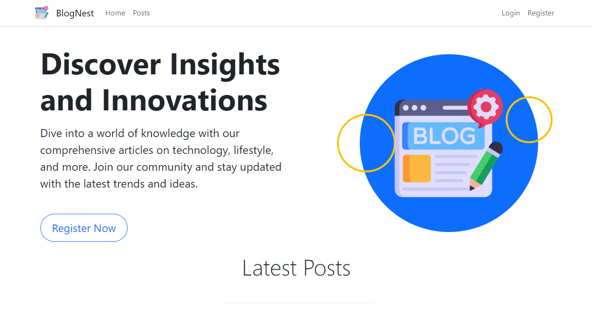
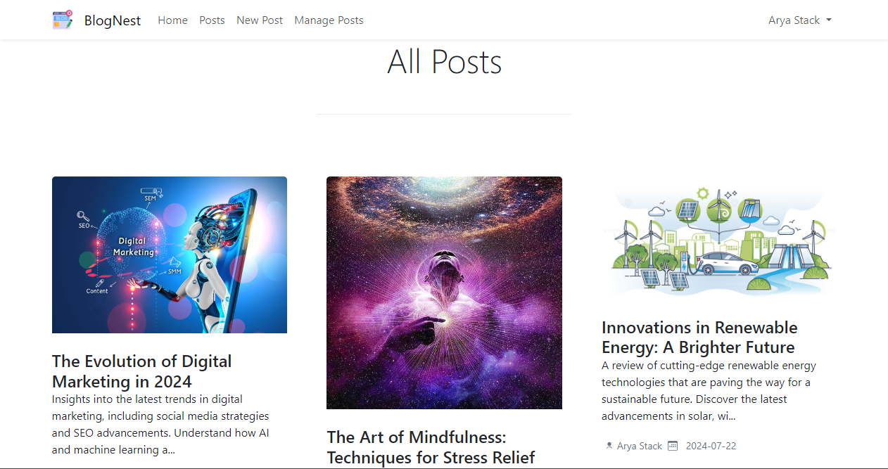
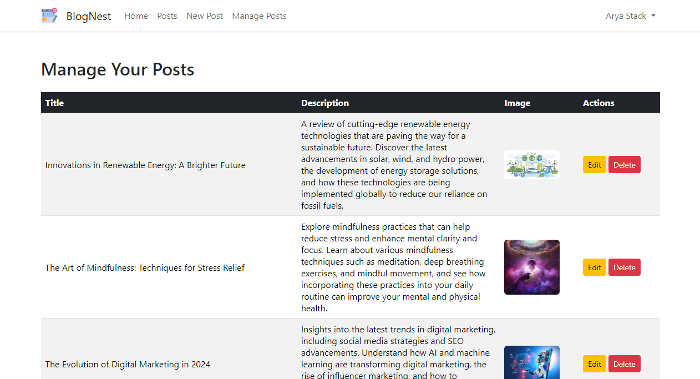
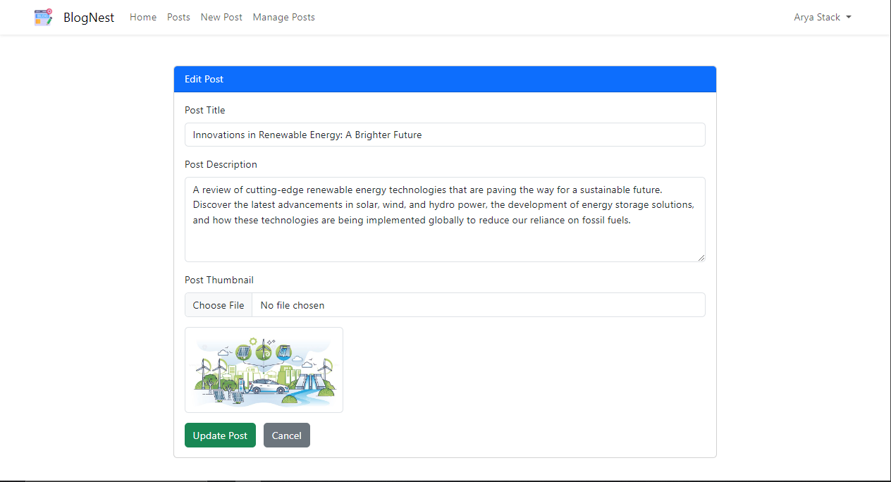

# BlogNest - Laravel Blog Site

BlogNest is a dynamic blog platform developed to share insights on various topics. It is created using Laravel 11. This project was initially based on a YouTube tutorial and has been enhanced with additional features to improve user experience and functionality. 

## Table of Contents
- [Features](#features)
- [Technologies Used](#technologies-used)
- [Usage](#usage)

## Features
- User Authentication (Login/Registration)
- Create, Edit, Delete, and View Blog Posts
- Pagination for blog posts
- Responsive design using Bootstrap
- Dynamic Hero Section
- Navbar and Footer components
- Image upload and display for blog posts
- Additional UI enhancements for better user experience

## Technologies Used
- Laravel (PHP framework)
- Bootstrap (CSS framework)
- MySQL (Database)
- Blade (Laravel's templating engine)

## Usage
- Visit the homepage at `http://localhost:8000`
- Register a new user or login with an existing account.
- Create, edit, or delete blog posts.
- Navigate through the blog posts using pagination.

## Screenshots

